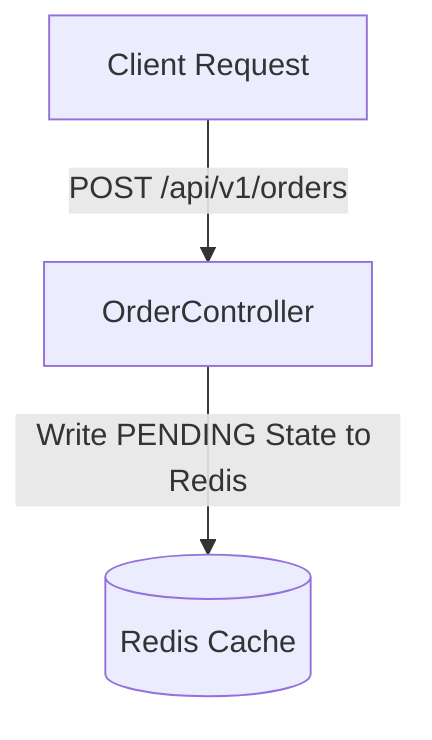

```
markdown
# High-Concurrency Ticketing API
```

```
A production-grade, event-driven ticket booking engine built with Spring Boot 3,
designed to handle flash-sale scenarios under extreme concurrent traffic
conditions. By decoupling transactional ingestion from downstream persistence
layers, this system eliminates typical relational database bottlenecks,
delivering sub-150ms response times.
```

```
---
```

- `##` 📋 `Table of Contents - [Architectural Blueprint & Data Flow](#-architectural-blueprint--data-flow)` 

- `[Infrastructure Tech Stack](#-infrastructure-tech-stack)` 

- `[Performance & Load Testing Benchmarks](#-performance--load-testingbenchmarks)` 

- `[Concurrency Control & Failure Resiliency](#-concurrency-control--failureresiliency)` 

- `[API Endpoints Reference](#-api-endpoints-reference)` 

- `[How to Download, Install, and Test Locally](#-how-to-download-install-andtest-locally)` 

- `[Next Milestone](#-next-milestone)` 

```
---
```

`## Architectural Blueprint & Data Flow` 🏗️� 

```
The core design principle of this API is **Asynchronous Decoupling and Event-
Driven Processing**. Instead of forcing incoming client requests to wait for
synchronous database row locks, transaction verification, and transactional
email dispatches, requests are ingested and acknowledged immediately.
```

```


```
    B -->|Publish to order.exchange| D[RabbitMQ Broker]
```

```
    D -->|Consume from order.submissions| E[OrderConsumer]
```

```
    E --> F[BookingFacade]
```

```
    F --> G[(PostgreSQL Database)]
    F -->|Spring DB Events| H[NotificationListener]
```

```
    H -->|Async MailHog Email| I[MailHog SMTP]
End-to-End Processing Flow
Fast-Path Ingestion: The client triggers POST /api/v1/orders. The
OrderController generates a unique tracking UUID and stores an initial PENDING
status token directly inside Redis with a 10-minute expiration buffer.
```

```
Message Broker Hand-off: The payload is instantly routed via OrderProducer to a
durable RabbitMQ direct exchange (order.exchange) using the order.routing.key.
```

```
HTTP 202 Acknowledgment: The application returns an immediate HTTP 202 ACCEPTED
status with the tracking ID back to the client, freeing the Tomcat executive
thread pool in ~100ms.
```

```
Asynchronous Background Processing: The OrderConsumer pulls the record from
order.submissions. It passes the context to BookingFacade, which executes
business constraints inside an isolated database transaction managed with
Optimistic Locking (@Version) to safely deduct inventory from PostgreSQL.
```

```
Dynamic State Cleansing: Once processed successfully, the temporary status
tracking token is removed from Redis, and the final state is safely persisted in
the database.
```

```
Transactional Mail Delivery: A separate thread pool managed by
```

```
NotificationListener intercepts an internal decoupled OrderConfirmedEvent
asynchronously (@Async), dispatching confirmation messages to a MailHog service
without slowing down core booking operations.
```

`Infrastructure Tech Stack` 🛠️� `Component Technology Purpose Core Engine Java 17 / Spring Boot 3.x Application runtime & framework Cache & State Store Redis (Lettuce Driver) Temporary state management & fast-path storage Message Broker RabbitMQ (AMQP Direct Topology) Asynchronous message queuing with DLQ Primary Database PostgreSQL Persistent data storage with ACID compliance SMTP Gateway MailHog Transactional notification testing Data Mapping MapStruct Zero-reflection compile-time data conversion Load Simulation Grafana k6 Performance testing & benchmarking` 📈 `Performance & Load Testing Benchmarks To validate the micro-architecture under intense saturation, a load test was executed via k6 simulating a high-concurrency event drop.` 

```
Test Configuration
Load Profile: 50 Virtual Users (VUs) executing concurrent shared loop iterations
simultaneously
```

```
Target Interface: POST /api/v1/orders (Asynchronous Booking Hand-off)
```

```
Test Duration: 10 minutes with graceful shutdown
```

```
Results (Warmed-Up Production State)
Once connection factories (HikariCP / Rabbit Channels) fully initialized, the
engine sustained the following metrics:
```

```
MetricMetric ValueArchitectural Significance
Throughput318.86 requests/secVolumetric processing capacity under
localized thread saturation
Average Response Time101.17 msRapid execution loop minimizing client
connection holding
95th Percentile (p95)124.20 ms95% of processing spikes remained bounded
below 125ms
Transaction Success Rate100% (0.00% Failed)Safe distribution across
backend worker nodes without error leakage
Min Response Time66.67 msPeak performance under optimal conditions
Max Response Time132.87 msBounded worst-case scenario within acceptable
limits
Raw Test Signature Output
bash
█ TOTAL RESULTS
HTTP
http_req_duration..............: avg=101.17ms min=66.67ms med=98.56ms
max=132.87ms p(90)=113.81ms p(95)=124.2ms
http_req_failed................: 0.00% 0 out of 50
http_reqs......................: 50    318.861893/s
```

```
EXECUTION
iteration_duration.............: avg=122.65ms min=93.15ms med=119.73ms
max=155.37ms p(90)=135.01ms p(95)=145.03ms
iterations.....................: 50    318.861893/s
NETWORK
data_received..................: 11 kB 72 kB/s
data_sent......................: 11 kB 73 kB/s
Note: The test demonstrates the system's ability to handle high-concurrency
loads with zero failures and consistent sub-150ms response times, validating the
asynchronous decoupling architecture.
```

🔒 `Concurrency Control & Failure Resiliency 1. High-Performance Concurrency Guard (Optimistic Locking) To protect seat allocation integrity without creating explicit database row deadlocks, the Event entity applies a JPA version checking mechanism:` 

```
java
@Entity
public class Event {
    @Version
    private Long version;
    // ... other fields
}
If two workers attempt to deduct seats from the same event simultaneously, one
transaction succeeds while the other throws an
OptimisticLockingFailureException.
```

```
2. Auto-Recovery Loops (Spring Retry Engine)
Rather than failing immediately when an entity version mismatch occurs,
BookingFacade handles it gracefully by retrying the seat assignment up to three
times before giving up:
```

```
java
@Retryable(
    retryFor = OptimisticLockingFailureException.class,
    maxAttempts = 3,
    backoff = @Backoff(delay = 50)
)
public void bookTicket(OrderDtoRequest orderDtoRequest) {
    orderService.orderATicket(orderDtoRequest);
}
```

```
3. Fault Isolation via Dead Letter Queues (DLQ)
If an unhandled exception strikes or all three retries fail, the system
isolation rules protect the message pipeline:
```

```
Dead Letter Routing: The main queue (order.submissions) automatically drops
unresolvable messages into order.dlx, routing them directly into
order.submissions.dlq
```

```
This keeps production channels flowing cleanly while allowing developers to
inspect failing payloads manually
```

`🔌 API Endpoints Reference Events Subsystem Method Endpoint Description POST /api/v1/events Initialize a ticketed event with maximum seat quotas GET /api/v1/events/{eventId} Retrieve active configuration metrics (Optimized with Redis Caching) DELETE /api/v1/events/{eventId} Flush an event resource completely PATCH /api/v1/events/{eventId}/seats Explicitly adjust core availability capacity Orders Subsystem Method Endpoint Description POST /api/v1/orders Ingest a booking request. Returns an immediate tracking UUID GET /api/v1/orders/status/{trackingId} Polling gateway. Returns the real-time status of your processing queue item (PENDING, CONFIRMED, FAILED) PATCH /api/v1/orders/{orderId} Process a ticket cancellation and return inventory back to the pool safely` ⚙️� `How to Download, Install, and Test Locally Prerequisites Ensure you have the following installed on your system:` 

```
Java Development Kit (JDK 17 or higher)
```

```
Maven 3.x+
```

```
Docker and Docker Compose
```

```
Clone or Download the Project
Open your terminal and clone the repository:
```

## `bash` 

`git clone https://github.com/YOUR_USERNAME/High-Concurrency-Ticketing-API.git cd High-Concurrency-Ticketing-API` ⚠️� `Important: Replace YOUR_USERNAME with your actual GitHub username.` 

```
Spin Up the Infrastructure Environment Stack
The project includes a docker-compose.yml file to launch all backing containers
automatically:
```

```
bash
docker-compose up -d
Accessing Dashboards:
```

```
RabbitMQ Management Console: http://localhost:15672 (Default credentials:
guest / guest)
```

```
MailHog Web UI Console: http://localhost:8025 (To inspect sent transaction
confirmation emails)
```

```
PostgreSQL Connection String: jdbc:postgresql://localhost:5432/ticketing_db
(Username: postgres, Password: 1111)
```

```
Build and Run the Application
```

```
Compile the codebase using Maven and launch the application:
```

## `bash` 

```
mvn clean spring-boot:run
The application will bootstrap and listen for incoming connections on port 8080.
```

```
How to Test the API Flow Manually
```

```
You can interact with the system using tools like Postman, curl, or any REST
client.
```

```
Step A: Create an Event
bash
curl -X POST http://localhost:8080/api/v1/events \
  -H "Content-Type: application/json" \
  -d '{
    "name": "Championship Finals",
    "dateForEventToStart": "2026-07-15T18:00:00Z",
    "totalSeats": 10000,
    "availableSeats": 10000
  }'
Note: Note the returned id (UUID) from the response payload.
Step B: Submit a Fast Checkout Ticket Order
bash
curl -X POST http://localhost:8080/api/v1/orders \
  -H "Content-Type: application/json" \
  -d '{
    "eventId": "YOUR_EVENT_UUID_HERE",
    "seatCount": 2,
    "email": "buyer@example.com"
  }'
The API will instantly return an HTTP 202 ACCEPTED status with a unique
trackingId.
```

```
Step C: Poll the Order Processing Status
bash
```

```
curl -X GET http://localhost:8080/api/v1/orders/status/YOUR_TRACKING_ID_HERE
This reads from Redis/Database, showing PENDING during execution, upgrading
shortly to CONFIRMED or FAILED.
```

```
Running the Load Simulation Engine
```

```
To trigger automated concurrent traffic loads using the bundled k6 benchmark
engine, open a separate terminal pane and run:
```

## `bash` 

```
k6 run src/main/resources/test.js
```

```
🔌 Next Milestone
```

```
Incorporate an optional signup/login module using secure authentication tokens
to establish identity mapping, transitioning guest transactions into
authenticated user order tracking histories.
```

```
🔌 License
```

```
This project is licensed under the MIT License - see the LICENSE file for
details.
```

